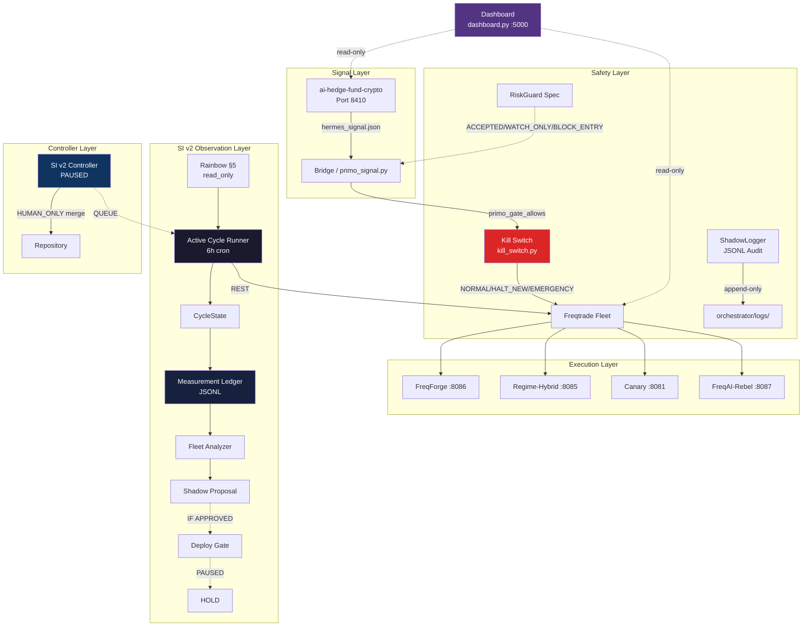
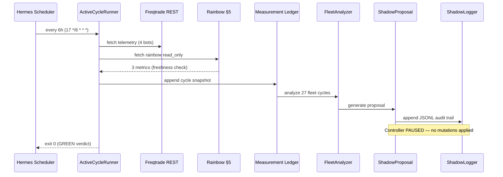
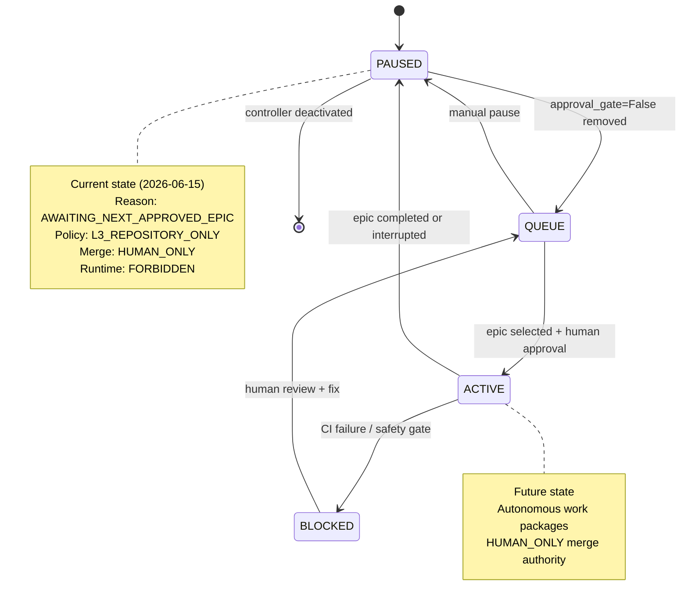

# System Architecture — Trading Hub

> **Canonical architecture reference.**
> Last updated: 2026-06-15
> Companion: `docs/state/current-operational-state.md` (runtime snapshot)

---

## 1. Data Flow Overview



---

## 2. Kill-Switch Wiring

```mermaid
flowchart LR
    subgraph Triggers["Trigger Sources"]
        CLI[kill_switch_trigger.sh<br/>CLI] --> KSPY[kill_switch.py]
        AUTO[auto-check<br/>Drawdown Guard] -->|reads fleet_risk_state.json| KSPY
        CRON[Cron Timer] -->|auto_clear_minutes| KSPY
    end

    subgraph State["State File"]
        JSON[var/kill_switch.json<br/>Atomic .tmp+replace] -->|mtime cache| KSPY
    end

    subgraph Consumers["Consumers"]
        KSPY -->|is_kill_active()| PS[primo_signal.py<br/>primo_gate_allows]
        KSPY -->|is_emergency()| PS
        PS -->|False = block| FT[Freqtrade Strategies]
        FT -->|HALT_NEW| HALT[Block entries<br/>Keep positions]
        FT -->|EMERGENCY| EMERG[Block entries<br/>Close positions]
        FT -->|NORMAL| NORM[Normal operation]
    end

    style KSPY fill:#dc2626,color:#fff
    style JSON fill:#f59e0b,color:#000
    style PS fill:#f59e0b,color:#000
```

**Modes:**

| Mode | Entries | Positions | Use Case |
|------|---------|-----------|----------|
| `NORMAL` | ✅ Allowed | ✅ Held | Normal operation |
| `HALT_NEW` | ❌ Blocked | ✅ Held | Elevated risk, manual pause |
| `EMERGENCY` | ❌ Blocked | ❌ Signal close | Drawdown breach, emergency |

**Thresholds (default):** HALT at 12% drawdown, EMERGENCY at 18%.

---

## 3. SI v2 Observation Loop



**Current state:**
- 27 fleet cycles completed
- 108 bot measurement points
- 24 proposal records
- All mutation counters: **zero**
- Scoring gate: **0/10** (awaiting producer freshness)

---

## 4. Controller State Machine



---

## 5. Component Ownership & Status

| Component | Role | Status | Authority |
|-----------|------|--------|-----------|
| `ai-hedge-fund-crypto` | Signal generation | 🟢 ACTIVE | Advisory only |
| `orchestrator/` | Hermes control plane | 🟢 ACTIVE | Audit, docs, git ops |
| `self_improvement_v2/` | SI v2 engine | 🟢 ACTIVE (observation) | Proposals only |
| `freqtrade/shared/kill_switch.py` | Central kill switch | 🟡 PENDING (#220) | Override all entries |
| `freqtrade/shared/primo_signal.py` | Signal bridge | 🟢 ACTIVE | Advisory + kill-switch block |
| `freqtrade/shared/fleet_risk_manager.py` | Fleet risk state | 🟢 ACTIVE | Advisory |
| `freqtrade/` (fleet) | Dry-run execution | 🟢 ACTIVE | Strategy logic |
| `freqforge/` | FreqForge bot | 🟢 ACTIVE | Strategy logic |
| `freqforge-canary/` | Canary bot | 🟢 ACTIVE | Strategy logic |
| `tools/freqforge/` | Shadow evaluator | 🟡 PASSIVE | None (observer) |
| `shadowlock/` | ShadowLock service | 🟢 ACTIVE | Evidence trail |
| `dashboard.py` | Operational dashboard | 🟢 ACTIVE | Read-only |
| `Caddyfile` | Reverse proxy | 🟢 ACTIVE | Fleet routing |
| RiskGuard (spec) | Safety gates | 🔶 SI v2 SPEC | Advisory design |
| ShadowLogger | Audit trail | 🟢 DEPLOYED | Evidence |
| SI v2 Controller | Automation control | ⏸ PAUSED | HUMAN_ONLY merge |

---

## 6. Network Topology

| Service | Port | Protocol | Access |
|---------|------|----------|--------|
| ai-hedge-fund-crypto | 8410 | HTTP | Localhost only |
| FreqForge API | 8086 | HTTP | Docker network |
| Regime-Hybrid API | 8085 | HTTP | Docker network |
| Canary API | 8081 | HTTP | Docker network |
| FreqAI-Rebel API | 8087 | HTTP | Docker network |
| Dashboard | 5000 | HTTP | Caddy reverse proxy |
| Rainbow stub | 8412 | HTTP | Localhost only |
| Docker socket proxy | 2375 | HTTP | Container-internal |

---

## 7. Related Documents

| Document | Location |
|----------|----------|
| Current Operational State | `docs/state/current-operational-state.md` |
| SI v2 Module Map | `self_improvement_v2/README.md` |
| Kill-Switch Runbook | `docs/runbooks/kill-switch.md` |
| Roadmap v2 | `docs/roadmap/roadmap-v2-blocker-first-runtime-ownership.md` |
| Safety Contract | `docs/specs/runtime-safety-contract.md` |
| AGENTS.md | `AGENTS.md` |
