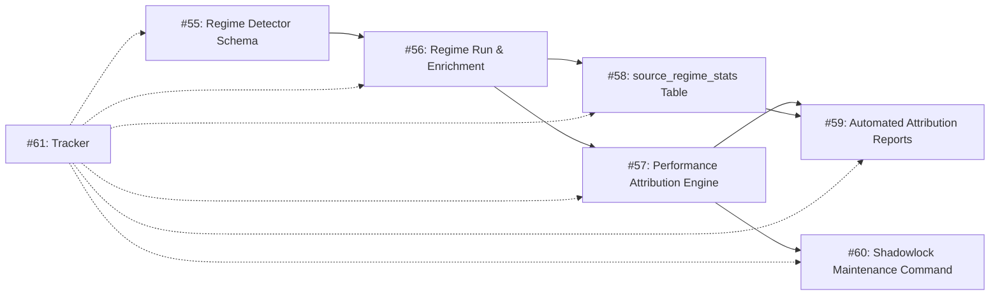

# Phase 1 Real-Data Intelligence Epic — Dependency-Ordered Issues

> **Target:** Enable real-data intelligence pipeline — regime detection,
> performance attribution, and automated reporting against live Freqtrade
> trade data.
>
> **Status:** 🟡 **Active** — #55 completed (merged PR #161), #56 in development.
> Issues #57–#61 remain open and depend on #56.
>
> **Current controller state:** PAUSED (AWAITING_NEXT_APPROVED_EPIC).
> Activation of this epic requires human approval and a dedicated controller
> session.

---

## Dependency Order



---

## Ordered Issue List

### 1. [#55 — Define canonical Regime Detector schema and integration boundary](https://github.com/GoLukeEnviro/trading-hub/issues/55)

| Property | Value |
|----------|-------|
| **State** | **✅ CLOSED (MERGED)** |
| **Code** | Spec document + 19 structural tests |
| **PR** | [#161](https://github.com/GoLukeEnviro/trading-hub/pull/161) (merged at `9017dd4`) |
| **Depends on** | Nothing (foundational) |
| **Description** | Define the canonical Regime Detector schema (regime labels, confidence thresholds, update cadence) and the integration boundary between the Regime Detector and Shadowlock enrichment pipeline. |
| **Evidence of work** | `docs/specs/si-v2-regime-detector-schema.md`, 19 structural tests |

### 2. [#56 — Implement Regime Detector run and Shadowlock enrichment](https://github.com/GoLukeEnviro/trading-hub/issues/56)

| Property | Value |
|----------|-------|
| **State** | OPEN |
| **Code** | None |
| **PR** | None |
| **Depends on** | #55 (schema must be defined first) |
| **Description** | Implement the actual Regime Detector execution and Shadowlock enrichment — the algorithm that classifies market regimes and writes enriched results to the Shadowlock SQLite database. |
| **Evidence of work** | None |

### 3. [#57 — Build Performance Attribution Engine by source and regime](https://github.com/GoLukeEnviro/trading-hub/issues/57)

| Property | Value |
|----------|-------|
| **State** | OPEN |
| **Code** | None |
| **PR** | None |
| **Depends on** | #56 (needs regime data to attribute performance) |
| **Description** | Build the Performance Attribution Engine that attributes trade outcomes by signal source and market regime. |
| **Evidence of work** | None |

### 4. [#58 — Implement source_regime_stats summary table and updater](https://github.com/GoLukeEnviro/trading-hub/issues/58)

| Property | Value |
|----------|-------|
| **State** | OPEN |
| **Code** | None |
| **PR** | None |
| **Depends on** | #56 (needs regime labels for stats aggregation) |
| **Description** | Implement the `source_regime_stats` summary table and its updater that stores aggregated performance statistics keyed by (source, regime). |
| **Evidence of work** | None |

### 5. [#59 — Generate automated Attribution Reports from Shadowlock and source_regime_stats](https://github.com/GoLukeEnviro/trading-hub/issues/59)

| Property | Value |
|----------|-------|
| **State** | OPEN |
| **Code** | None |
| **PR** | None |
| **Depends on** | #57 and #58 (needs both attribution engine and summary table) |
| **Description** | Generate automated Attribution Reports from Shadowlock data and `source_regime_stats` — the human-readable output layer. |
| **Evidence of work** | None |

### 6. [#60 — Add Shadowlock SQLite maintenance command and approval-gated daily job plan](https://github.com/GoLukeEnviro/trading-hub/issues/60)

| Property | Value |
|----------|-------|
| **State** | OPEN |
| **Code** | None |
| **PR** | None |
| **Depends on** | #57 (needs attribution engine to justify maintenance cadence) |
| **Description** | Add a Shadowlock SQLite maintenance command (vacuum, cleanup) and plan for an approval-gated daily job. |
| **Evidence of work** | None |

### 7. [#61 — Tracker — Intelligence Layer implementation](https://github.com/GoLukeEnviro/trading-hub/issues/61)

| Property | Value |
|----------|-------|
| **State** | OPEN |
| **Code** | None |
| **PR** | None |
| **Depends on** | All of #55–#60 (tracker spans the entire epic) |
| **Description** | Top-level tracker issue for the Phase 1 Intelligence Layer implementation. Spans issues #55–#60. |
| **Evidence of work** | None — tracker only |

---

## Dependency Graph Summary

```text
#55 (Schema)
  └── #56 (Regime Run)
        ├── #57 (Attribution Engine)
        │     ├── #59 (Automated Reports)
        │     └── #60 (SQLite Maintenance)
        └── #58 (Stats Table)
              └── #59 (Automated Reports)

#61 (Tracker) — umbrella for all above
```

---

## Pre-requisites for Epic Activation

Before this epic can begin execution:

1. ❌ Timer-based controller activation must be approved and installed (currently **blocked**)
2. ❌ Dedicated user with scoped git+GitHub credentials must be created (currently **blocked**)
3. ❌ #43 (FleetRiskManager dry-run fix) should ideally be resolved first
4. ✅ Controller is PAUSED and ready for next epic assignment

---

*Updated at commit 9017dd4, 2026-06-11. Issue #55 completed and merged.*
