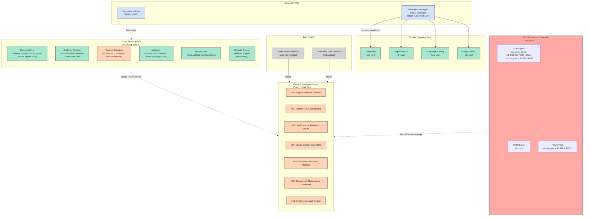

# Post-PR-160 Architecture — Simplified Overview

> **Canonical at commit `fdac27c`** — controller contract layer is now merged.
>
> This diagram describes the architecture **after** PR #160. The controller is
> PAUSED. All SI v2 intelligence runs on fixtures only.

---

## Architecture Diagram



---

## Layer Summary

| Layer | Status | Description |
|-------|--------|-------------|
| **Signal Generation** | ✅ ACTIVE | `ai-hedge-fund-crypto` runs live on VPS, outputs signal JSON |
| **Execution Fleet** | ✅ DRY-RUN | 4 Freqtrade bots in dry-run mode, no live orders |
| **SI v2 Controller** | 🚫 PAUSED | Repository-level control plane, awaiting next approved epic |
| **SI v2 Offline Pipeline** | ✅ COMPLETE (fixture) | All offline components built, but fixture-only |
| **Phase 1 Intelligence** | ⬛ NOT STARTED | Issues #55–#61, all OPEN, no code written |
| **Timer Activation** | ⛔ BLOCKED | Cron-based scheduler not installed |
| **Dedicated User** | ⛔ BLOCKED | Credential isolation not implemented |
| **RiskGuard (production)** | 📄 SPEC ONLY | No deployed component |

---

## Data Flow Summary

```
[ai-hedge-fund-crypto]  →  signal JSON  →  [Freqtrade bots (dry-run)]
                                          ↕ (read-only)
[Shadowlock Writer]  →  SQLite  →  [SI v2 Offline Pipeline (fixture-only)]

[External state: /opt/data/si-v2-controller/state/]
    ├── STATE.json      controller_status: "PAUSED"
    ├── QUEUE.json      empty
    ├── CURRENT_EPIC.md no active epic
    ├── HANDOFF.md      awaiting next approved epic
    └── runs/           proof report only
```

---

## Key Invariants

1. **No live trading** — all bots `dry_run=true`, `LIVE_FORBIDDEN` state
2. **No timer-based automation** — controller activation requires manual invocation
3. **No dedicated user** — no credential isolation for controller operations
4. **No production attribution** — all evidence/attribution is fixture-based
5. **Controller merge policy: HUMAN_ONLY** — no automated merge

---

*Architecture diagram at commit fdac27c, 2026-06-11*
