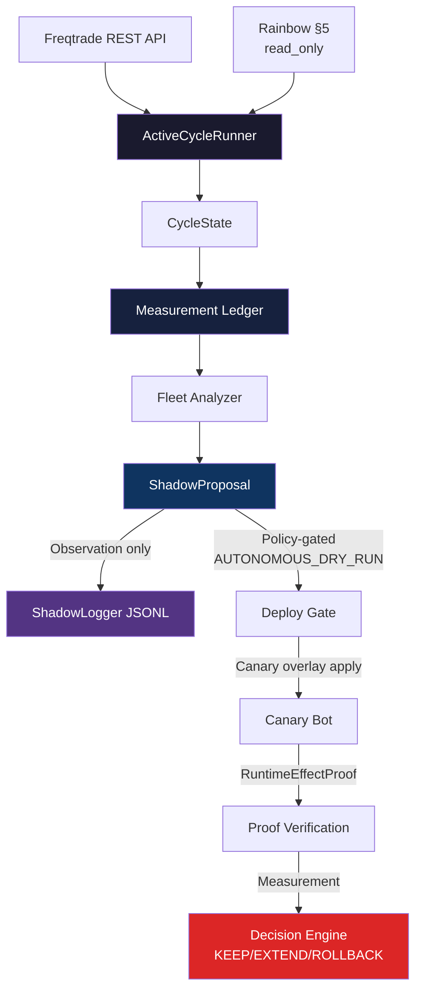

# Self-Improvement v2 (SI v2)

> **Package:** `si_v2` (under `self_improvement_v2/src/`)
> **Python:** >=3.11, `pydantic>=2.0`
> **Lint:** Ruff (line-length 120)
> **Status:** Active — see `docs/state/current-operational-state.md` for current snapshot

---

## 1. What is SI v2?

SI v2 is the self-improvement engine for the Trading Hub. It replaces v1's ad-hoc
approach with structured, deterministic, auditable cycles.

**Core loop:**

```
Freqtrade REST  →  ActiveCycleRunner  →  CycleState  →  Measurement Ledger  →  ShadowProposal
     ↑                                                                              │
     └─────────────────────────── apply ────────────────────────────────────────────┘
```

The loop operates in **AUTONOMOUS_DRY_RUN** mode (see ADR-2026-07-01).
Dry-run apply is policy-gated, canary-first, allowlist-based, audit-logged,
snapshot-backed, rollback-capable, and measurement-bound. Human approval
is required for live-mode transitions and emergency overrides, not for
every qualified dry-run candidate.

**Historical note:** The prior human-gated phase
(`HUMAN_GATED_CANARY_APPLY_PHASE_1` / `HUMAN_GATED_CANARY_APPLY_PHASE_3C`)
proved the controlled apply chain and is superseded for dry-run by
ADR-2026-07-01.

The core loop remains read-only (ActiveCycleRunner → CycleState → ShadowProposal).
The controlled apply chain adds:
- `check_readiness()` — policy gate evaluation (all gates, no side effects)
- `execute_apply()` — policy-gated overlay write (canary-only, safe parameters only)
- `plan_canary_restart_with_overlay()` — restart planning with overlay
- `check_restart_gate()` — restart safety gate
- `run_canary_restart_with_overlay()` — canary restart execution
- `RuntimeEffectProof` — post-restart verification
- `Measurement Decision Engine` — post-apply measurement and KEEP/EXTEND/ROLLBACK decision

Live trading remains **target architecture**, not enabled. No `dry_run=false`
without explicit human approval and all live-readiness gates passing.
D1 (Live Fleet Rollout) is blocked — see #423.

---

## 2. Module Map

### Core Loop (`src/si_v2/loop/`)

| Module | Purpose |
|--------|---------|
| `active_cycle_runner.py` | Orchestrates a single observation cycle. Entry point for cron/scheduler |
| `cycle_state.py` | Tracks cycle history, current phase, and deterministic IDs |
| `fleet_analyzer.py` | Analyzes multi-bot fleet telemetry for health, drift, and anomalies |
| `telemetry_normalizer.py` | Normalizes per-bot telemetry into a uniform schema |

### Measurement (`src/si_v2/measurement/`)

| Module | Purpose |
|--------|---------|
| `ledger.py` | Core Measurement Ledger — append-only JSONL, deterministic IDs |
| `build_measurement_ledger.py` | Build a ledger from cycle state snapshots |
| `models.py` | Pydantic models for measurement data |
| `report.py` | Generate human-readable reports from ledger data |
| `attribution.py` | Attribute measurements to sources |
| `decision_engine.py` | Post-apply measurement decision (KEEP / EXTEND / ROLLBACK) |

### Rainbow Integration (`src/si_v2/rainbow/`)

| Module | Purpose |
|--------|---------|
| `client.py` | HTTP client for Rainbow stub server (read-only) |
| `client_fixture_harness.py` | Test harness for Rainbow client |
| `validator.py` | Validate Rainbow response schema |
| `status.py` | Rainbow status reporting |
| `drift_guard.py` | Detect drift between Rainbow and expected source |
| `shadowlock_events.py` | ShadowLock integration for Rainbow events |

### Proposal (`src/si_v2/propose/`)

| Module | Purpose |
|--------|---------|
| `shadow_proposal.py` | Generate proposals from measurement analysis |
| `strategy_adapter/` | Sandboxed strategy mutation (validator, schema, sandbox, mutator, path_guard) |
| `weight_proposal/` | Weight optimization proposals (engine, models, normalization) |
| `proposal_scoring/` | Score proposals (scoring, policy, rejection) |
| `similarity_checker.py` | Detect similar/duplicate proposals |

### Apply Chain (`src/si_v2/apply_actuator/`)

| Module | Purpose |
|--------|---------|
| `controlled_apply_actuator.py` | Readiness check + overlay apply (historical human-gated phase) |
| `policy.py` | Autonomy policy — L3 token bypass, G10 bypass, allowlist enforcement |

### Rollout (`src/si_v2/rollout/`)

| Module | Purpose |
|--------|---------|
| `fleet_rollout_input_resolver.py` | Phase 10.1 — Fleet rollout input resolution |
| `fleet_rollout_ready_evidence_runner.py` | Phase 10.2 — READY-only fleet chain evidence runner |
| `fleet_dry_run_runtime_executor.py` | Phase 10.3 — Controlled dry-run fleet runtime executor |
| `fleet_post_fleet_measurement_watcher.py` | Phase 10.4 — Post-fleet measurement watcher |
| `fleet_dry_run_rollback_executor.py` | Phase 10.5 — Dry-run fleet rollback executor |
| `next_iteration_selector.py` | Phase 10.6 — Next iteration selector |

### Live Canary (`src/si_v2/live/`)

| Module | Purpose |
|--------|---------|
| `live_readiness_evidence_audit.py` | Track B — Live readiness evidence audit (7 checks) |
| `production_alerting_gate.py` | Track B — Production alerting readiness gate |
| `live_canary_approval_gate.py` | Track C — Human approval gate for live canary |
| `live_canary_config_plan.py` | Track C — Live canary config plan (no activation) |
| `live_canary_activation_ceremony.py` | Track C — Live canary activation ceremony |
| `live_canary_measurement_decision.py` | Track C — Live canary measurement & decision |

### Adapters (`src/si_v2/adapters/`)

| Module | Purpose |
|--------|---------|
| `freqtrade_adapter.py` | Base adapter for Freqtrade REST API |
| `freqtrade_rest_readonly.py` | Read-only Freqtrade API client (safe) |
| `freqtrade_auth_resolver.py` | Auth credential resolver for FT APIs |
| `real_freqtrade_adapter.py` | Real (authenticated) Freqtrade adapter |
| `real_base.py` | Base class for real adapters with gates |
| `audit.py` | Adapter audit logging |
| `docker_adapter.py` / `real_docker_adapter.py` | Docker API adapters |
| `dry_run_stub.py` | Dry-run stub for testing |
| `telegram_adapter.py` | Telegram notification adapter |
| `call_budget.py` | API call budget tracking |

### Observe (`src/si_v2/observe/`)

| Module | Purpose |
|--------|---------|
| `market_data.py` | Market data observation |
| `trade_exporter.py` | Export trade history from Freqtrade |
| `telemetry_history.py` | Append-only JSONL telemetry history store, reader, and trend analyzer |

### Deploy (`src/si_v2/deploy/`)

| Module | Purpose |
|--------|---------|
| `deployment_plan.py` | Deployment plan generation |
| `rollback_plan.py` | Rollback plan generation |
| `shadow_logger.py` | ShadowLogger — append-only JSONL audit trail |
| `shadow_mode.py` | Shadow mode execution |

### Validation (`src/si_v2/validation/`)

| Module | Purpose |
|--------|---------|
| `gates.py` | Validation gates (schema, freshness, allowlist) |
| `matrix.py` | Decision matrix for gate verdicts |
| `models.py` | Pydantic models for validation |
| `renderers.py` | Render validation results to human-readable format |

### Supporting modules

| Package | Purpose |
|---------|---------|
| `attribution/` | Attribution engine + offline aggregator + report renderer |
| `backtest/` | Backtest runner + walk-forward validation |
| `config/` | Configuration gate module |
| `cron/` | Cron job generator + planner + schema |
| `episode/` | Offline episode learning + reporting |
| `evidence/` | Evidence bundle builder + input pipeline |
| `integrations/ai4trade/` | AI4Trade integration (boundary, REST, protocols) |
| `proofs/` | Proof-of-concept modules (telemetry, shadowproposal, REST) |
| `regime/` | Regime detection + legacy adapter |
| `reports/` | Episode report builder + renderers |
| `runtime_probe/` | Read-only runtime probing (models, redaction) |
| `signals/` | Freqtrade signal fusion |
| `state/` | State schemas |
| `source_regime_stats/` | Source-regime statistics (db, rebuild, update) |

---

## 3. Data Flow



---

## 4. Entry Points

### Active Cycle Runner (scheduled)

```bash
# Via Hermes cron (current setup)
# Scheduler job: si-v2-active-cycle (6h, log-only)
# Wrapper: /opt/data/scripts/si-v2-active-cycle-runner.sh

# Direct invocation
cd /home/hermes/projects/trading
python3 -m si_v2.loop.active_cycle_runner
```

### Tests

```bash
# Run all SI v2 tests
cd self_improvement_v2
python3 -m pytest src/

# Specific test modules
python3 -m pytest src/si_v2/validation/tests/
python3 -m pytest src/si_v2/propose/proposal_scoring/tests/
python3 -m pytest src/si_v2/reports/tests/
```

### Linting

```bash
cd self_improvement_v2
ruff check src/
```

---

## 5. Environment Variables

| Variable | Purpose |
|----------|---------|
| `SI_V2_RAINBOW_ENABLED` | Enable Rainbow read-only source (default: false — disabled unless env override set) |
| `SI_V2_RAINBOW_MODE` | `fixture` or `read_only` (NOT `live`) |
| `FREQTRADE_API_KEY_*` | FT API credentials (see `freqtrade_auth_resolver.py`) |
| `SI_V2_L3_TOKEN` | L3 activation token for apply/restart (AUTONOMOUS_DRY_RUN bypass) |
| `SI_V2_G10_BYPASS` | G10 scoring gate bypass flag |

---

## 6. Safety Constraints

1. **Controller target is AUTONOMOUS_DRY_RUN** — policy-gated, canary-first,
   allowlist-based. See ADR-2026-07-01.
2. **Dry-run invariant** — all active bots run `dry_run=true`.
3. **Rainbow is read_only** — scored but never applied, never executed.
4. **Ledger is append-only JSONL** — no modification, no deletion.
5. **ShadowLogger is required** for all decision/write operations.
6. **RiskGuard is the preferred risk authority** — loop respects its verdicts.
7. **Live trading is not enabled** — `LIVE_FORBIDDEN` state machine position.
   D1 (Live Fleet Rollout) is blocked by C4 `ROLLBACK_RECOMMENDED` and
   missing `APPROVED_LIVE_FLEET_ROLLOUT` marker. See #423.
8. **Human approval** is required for live-mode transitions and emergency
   overrides, not for every qualified dry-run candidate.

---

## 7. Related Documents

| Document | Location |
|----------|----------|
| Current Operational State | `docs/state/current-operational-state.md` |
| Live Roadmap (#423) | GitHub Issue #423 |
| SI v2 Capability Matrix | `docs/state/si-v2-capability-matrix.md` |
| Architecture | `docs/ARCHITECTURE.md` |
| SI-v2 Detail Architecture | `docs/architecture/si-v2-autonomous-dry-run-loop.md` |
| ADR: Autonomous Dry-Run | `docs/decisions/ADR-2026-07-01-si-v2-autonomous-dry-run-loop-live-target.md` |
| SI v2 Docs | `self_improvement_v2/docs/` (ADR-style per-issue docs) |
| CI Offline Smoke | `self_improvement_v2/docs/CI_OFFLINE_SMOKE.md` |

---

## 8. Telemetry History Contract

The telemetry history store (`src/si_v2/observe/telemetry_history.py`) is an append-only
JSONL-based storage for per-bot telemetry snapshots across multiple SI v2 active cycles.

### Schema

- **Format:** JSONL (one JSON object per line, append-only)
- **File:** `state/telemetry_history/telemetry_YYYYMMDD.jsonl` (date-based rotation)
- **Version:** `telemetry_history_v1`
- **Safety:** No secrets, JWTs, or credential values are ever persisted.
  A belt-and-suspenders `_assert_no_secrets` check runs on every append.

### Key Components

| Class | Responsibility |
|-------|---------------|
| `BotSnapshot` | Normalized, secret-free telemetry snapshot for one bot in one cycle |
| `TelemetryHistoryRecord` | One complete SI v2 run record (all bots grouped) |
| `TelemetryHistoryStore` | Append-only JSONL writer with secret redaction |
| `TelemetryHistoryReader` | Safe reader for last N runs (handles corruption, schema mismatch) |
| `TelemetryHistoryAnalyzer` | Trend computation: strongest/weakest bot, profit trend, failure rate |
| `EvidenceWindow` | Serializable window metadata for ShadowProposal extension |

### Per-bot Trend Analysis

The `TelemetryHistoryAnalyzer` can compute over the last N runs:

- **Strongest bot** — highest mean profit ratio
- **Weakest bot** — lowest mean profit ratio
- **Profit trend** — improving / declining / stable (first-half vs second-half comparison)
- **Failure rate** — ratio of read failures to total attempts
- **Ping success rate** — ratio of successful pings
- **Fleet freshness** — whether the most recent run is within 24h

### Validation

```bash
python -m pytest tests/test_telemetry_history.py -q
ruff check src/si_v2/observe/telemetry_history.py
```

### History Enforcement Gate

Starting with the first active cycle that writes history, proposals are evaluated
against a minimum telemetry history requirement:

- **`MIN_REQUIRED_TELEMETRY_HISTORY_RUNS = 5`** (default, configurable)
- If `EvidenceWindow.runs_observed < min_required_runs`:
  - Proposal status set to `INSUFFICIENT_HISTORY`
  - Reason code: `insufficient_telemetry_history`
  - Promotion/apply eligibility blocked
- If `EvidenceWindow` is completely missing:
  - Proposal status set to `MISSING_EVIDENCE_WINDOW`
  - Reason code: `missing_evidence_window`
  - Fail-closed: no normal proposal evaluation possible
- If `runs_observed >= min_required_runs`:
  - Status: `NORMAL`
  - Normal proposal evaluation proceeds

The enforcement status is visible in:
- `safety_results[].history_status` and `.history_reason_codes` (Step 4 output)
- `per_bot_decisions[].history_status` and `.min_required_runs` (evidence bundle)
- `telemetry_history.min_required_runs` (fleet-level evidence bundle)

---

## 9. Controlled Apply Chain

The controlled SI-v2 apply path consists of the following modules on `main`:

| Step | Module | Phase | File |
|------|--------|-------|------|
| 1 | Candidate Pipeline | 6A | `pipeline/candidate_to_apply.py` |
| 2 | Readiness / Policy Gate | — | `apply_actuator/policy.py` |
| 3 | Overlay Apply | 1 (historical) | `controlled_apply_actuator.py` |
| 4 | Restart Plan | 3B-A | `restart_with_overlay.py` |
| 5 | Restart Gate | 3B-B | `restart_gate.py` |
| 6 | Runtime Executor | 3C-A | `runtime_executor.py` |
| 7 | RuntimeEffectProof | 3C-B | `proof.py` |
| 8 | Measurement Decision | 4A | `measurement/decision_engine.py` |
| 9 | Rollback Rehearsal | 5A | `rollback_rehearsal.py` |

### Fleet Rollout Chain (Track A, Phase 10.1–10.6)

| Step | Module | PR |
|------|--------|----|
| 10.1 | Fleet Rollout Input Resolver | #421 |
| 10.2 | READY-only Fleet Chain Evidence Runner | #422 |
| 10.3 | Controlled Dry-Run Fleet Runtime Executor | #424 |
| 10.4 | Post-Fleet Measurement Watcher | #425 |
| 10.5 | Dry-Run Fleet Rollback Executor | #427 |
| 10.6 | Next Iteration Selector | #428 |

### Live Readiness Chain (Track B)

| Step | Module | PR |
|------|--------|----|
| B1 | Live Readiness Evidence Audit | #429 |
| B2 | Production Risk Limits Spec | #430 |
| B3 | Incident Response & Go-Live Runbooks | #431 |
| B4 | Production Alerting Gate | #432 |

### Live Canary Chain (Track C)

| Step | Module | PR |
|------|--------|----|
| C1 | Human Approval Gate | #433 |
| C2 | Live Canary Config Plan | #434 |
| C3 | Live Canary Activation Ceremony | #436 |
| C4 | Live Canary Measurement & Decision | #437 |

### C4 Outcome (2026-07-03)

C4 was executed against real C3 ceremony artifacts. **Decision: ROLLBACK_RECOMMENDED**
(max_drawdown_pct = 82.79% breach). Validated by #438 triage.
Human selected rollback path (#442). Canary baseline return completed (#447).
Post-return verification passed (#449).

### D1 Status (Live Fleet Rollout)

**BLOCKED.** Requires:
1. C4 `KEEP` decision (current: `ROLLBACK_RECOMMENDED`)
2. `APPROVED_LIVE_FLEET_ROLLOUT` marker (does not exist)

See GitHub Issue #423 for the canonical live roadmap.

---

## 10. Canary Apply History

The first canary dry-run apply was proven with `RuntimeEffectProof=GREEN`:

| Date | Change | Target | Proof | Decision |
|------|--------|--------|-------|----------|
| 2026-06-27 | `max_open_trades` 3→2 | freqtrade-freqforge-canary | GREEN | KEEP_CANARY_OVERLAY (YELLOW/MEDIUM) |

See `docs/state/current-operational-state.md` for the full measurement timeline.
