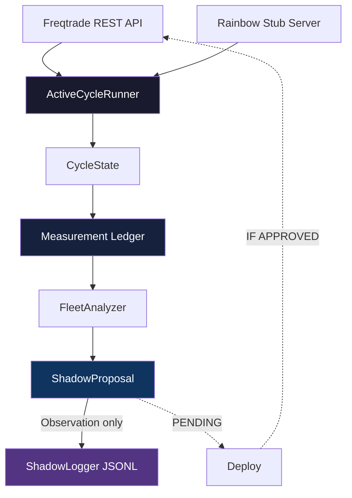

# Self-Improvement v2 (SI v2)

> **Package:** `si_v2` (under `self_improvement_v2/src/`)
> **Python:** >=3.11, `pydantic>=2.0`
> **Lint:** Ruff (line-length 120)
> **Status:** Active development — see `docs/state/current-operational-state.md` for phase status

---

## 1. What is SI v2?

SI v2 is the self-improvement engine for the Trading Hub. It replaces v1's ad-hoc
approach with structured, deterministic, auditable cycles.

**Core loop:**

```
Freqtrade REST  →  ActiveCycleRunner  →  CycleState  →  Measurement Ledger  →  ShadowProposal
     ↑                                                                              │
     └─────────────────────────── apply ────────────────────────────────────────────┘
```

The loop is currently operating in **observation-only mode** (controller PAUSED,
all mutation counters zero). It reads Freqtrade telemetry + Rainbow data, builds
a Measurement Ledger, analyzes fleet health, and produces proposals — but never
applies them autonomously.

---

## 2. Module Map

### Core Loop (`src/si_v2/loop/`)

| Module | Purpose |
|--------|---------|
| `active_cycle_runner.py` | Orchestrates a single observation cycle. Entry point for cron/scheduler |
| `cycle_state.py` | Tracks cycle history, current phase, and deterministic IDs |
| `fleet_analyzer.py` | Analyzes multi-bot fleet telemetry for health, drift, and anomalies |
| `telemetry_normalizer.py` | Normalizes per-bot telemetry into a uniform schema |

### Measurement (`src/si_v2/measurement/`)

| Module | Purpose |
|--------|---------|
| `ledger.py` | Core Measurement Ledger — append-only JSONL, deterministic IDs |
| `build_measurement_ledger.py` | Build a ledger from cycle state snapshots |
| `models.py` | Pydantic models for measurement data |
| `report.py` | Generate human-readable reports from ledger data |
| `attribution.py` | Attribute measurements to sources |

### Rainbow Integration (`src/si_v2/rainbow/`)

| Module | Purpose |
|--------|---------|
| `client.py` | HTTP client for Rainbow stub server (read-only) |
| `client_fixture_harness.py` | Test harness for Rainbow client |
| `validator.py` | Validate Rainbow response schema |
| `status.py` | Rainbow status reporting |
| `drift_guard.py` | Detect drift between Rainbow and expected source |
| `shadowlock_events.py` | ShadowLock integration for Rainbow events |

### Proposal (`src/si_v2/propose/`)

| Module | Purpose |
|--------|---------|
| `shadow_proposal.py` | Generate proposals from measurement analysis |
| `strategy_adapter/` | Sandboxed strategy mutation (validator, schema, sandbox, mutator, path_guard) |
| `weight_proposal/` | Weight optimization proposals (engine, models, normalization) |
| `proposal_scoring/` | Score proposals (scoring, policy, rejection) |
| `similarity_checker.py` | Detect similar/duplicate proposals |

### Adapters (`src/si_v2/adapters/`)

| Module | Purpose |
|--------|---------|
| `freqtrade_adapter.py` | Base adapter for Freqtrade REST API |
| `freqtrade_rest_readonly.py` | Read-only Freqtrade API client (safe) |
| `freqtrade_auth_resolver.py` | Auth credential resolver for FT APIs |
| `real_freqtrade_adapter.py` | Real (authenticated) Freqtrade adapter |
| `real_base.py` | Base class for real adapters with gates |
| `audit.py` | Adapter audit logging |
| `docker_adapter.py` / `real_docker_adapter.py` | Docker API adapters |
| `dry_run_stub.py` | Dry-run stub for testing |
| `telegram_adapter.py` | Telegram notification adapter |
| `call_budget.py` | API call budget tracking |

### Observe (`src/si_v2/observe/`)

| Module | Purpose |
|--------|---------|
| `market_data.py` | Market data observation |
| `trade_exporter.py` | Export trade history from Freqtrade |

### Deploy (`src/si_v2/deploy/`)

| Module | Purpose |
|--------|---------|
| `deployment_plan.py` | Deployment plan generation |
| `rollback_plan.py` | Rollback plan generation |
| `shadow_logger.py` | ShadowLogger — append-only JSONL audit trail |
| `shadow_mode.py` | Shadow mode execution |

### Validation (`src/si_v2/validation/`)

| Module | Purpose |
|--------|---------|
| `gates.py` | Validation gates (schema, freshness, allowlist) |
| `matrix.py` | Decision matrix for gate verdicts |
| `models.py` | Pydantic models for validation |
| `renderers.py` | Render validation results to human-readable format |

### Supporting modules

| Package | Purpose |
|---------|---------|
| `attribution/` | Attribution engine + offline aggregator + report renderer |
| `backtest/` | Backtest runner + walk-forward validation |
| `config/` | Configuration gate module |
| `cron/` | Cron job generator + planner + schema |
| `episode/` | Offline episode learning + reporting |
| `evidence/` | Evidence bundle builder + input pipeline |
| `integrations/ai4trade/` | AI4Trade integration (boundary, REST, protocols) |
| `proofs/` | Proof-of-concept modules (telemetry, shadowproposal, REST) |
| `regime/` | Regime detection + legacy adapter |
| `reports/` | Episode report builder + renderers |
| `runtime_probe/` | Read-only runtime probing (models, redaction) |
| `signals/` | Freqtrade signal fusion |
| `state/` | State schemas |
| `source_regime_stats/` | Source-regime statistics (db, rebuild, update) |

---

## 3. Data Flow



Dashed lines represent paths that are **not yet operational** (controller PAUSED).

---

## 4. Entry Points

### Active Cycle Runner (scheduled)

```bash
# Via Hermes cron (current setup)
# Scheduler job: si-v2-active-cycle (6h, log-only)
# Wrapper: /opt/data/scripts/si-v2-active-cycle-runner.sh

# Direct invocation
cd /home/hermes/projects/trading
python3 -m si_v2.loop.active_cycle_runner
```

### Tests

```bash
# Run all SI v2 tests
cd self_improvement_v2
python3 -m pytest src/

# Specific test modules
python3 -m pytest src/si_v2/validation/tests/
python3 -m pytest src/si_v2/propose/proposal_scoring/tests/
python3 -m pytest src/si_v2/reports/tests/
```

### Linting

```bash
cd self_improvement_v2
ruff check src/
```

---

## 5. Environment Variables

| Variable | Purpose |
|----------|---------|
| `SI_V2_RAINBOW_ENABLED` | Enable Rainbow read-only source (default: true) |
| `SI_V2_RAINBOW_MODE` | `live` or `fixture` |
| `FREQTRADE_API_KEY_*` | FT API credentials (see `freqtrade_auth_resolver.py`) |

---

## 6. Safety Constraints

1. **Controller is PAUSED** — no autonomous mutations are applied.
2. **All mutation counters are zero** — verified every cycle.
3. **Rainbow is read_only** — scored but never applied, never executed.
4. **Ledger is append-only JSONL** — no modification, no deletion.
5. **ShadowLogger is required** for all decision/write operations.
6. **RiskGuard is the preferred risk authority** — loop respects its verdicts.

---

## 7. Related Documents

| Document | Location |
|----------|----------|
| Current Operational State | `docs/state/current-operational-state.md` |
| SI v2 Capability Matrix | `docs/state/si-v2-capability-matrix.md` |
| Roadmap v2 | `docs/roadmap/roadmap-v2-blocker-first-runtime-ownership.md` |
| Architecture | `docs/ARCHITECTURE.md` (planned) |
| SI v2 Docs | `self_improvement_v2/docs/` (ADR-style per-issue docs) |
| CI Offline Smoke | `self_improvement_v2/docs/CI_OFFLINE_SMOKE.md` |
